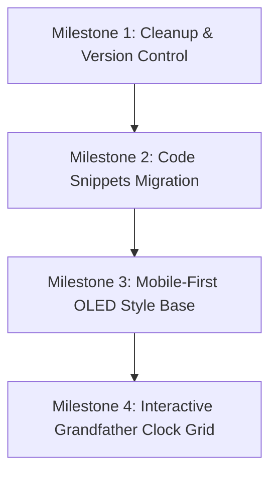

# First Implementation Recommendation & Roadmap

This document outlines the first actionable development milestones to transition from the current audit baseline to active, safe feature implementation on `junkfeathers.com`.

---

## 1. Summary of Recommended Roadmap

We propose a phased approach to ensure structural safety and keep code tracked correctly:

---

## 2. Milestone Details & Tasks

### Milestone 1: Environment Cleanup & Git Initialization (Estimated: 2 hours)
* **Goal**: Prepare a clean directory structure and secure the codebase.
* **Tasks**:
  1. Delete disabled plugin folders (`hostinger-affiliate-plugin.disabled`, etc.) from `wp-content/plugins/` to clean the workspace.
  2. Create a `/docs/` directory at the project root and copy these baseline audit reports into it.
  3. Create the `.gitignore` file using the template in [REPOSITORY_SCOPE_RECOMMENDATION.md](file:///C:/Users/joned/.gemini/antigravity/brain/e1a5047e-cb92-4d47-bd90-381f7057f86b/REPOSITORY_SCOPE_RECOMMENDATION.md).
  4. Initialize a Git repository at the root (`app/public/`) and create the initial commit tracking only the child theme (`junkfeathers-machine`) and `/docs/`.

### Milestone 2: Code Snippets Refactoring (Estimated: 2 hours)
* **Goal**: Move custom PHP from the database into version control.
* **Tasks**:
  1. Create a new custom plugin directory: `/wp-content/plugins/junkfeathers-core/`.
  2. Create a main file `junkfeathers-core.php` with standard WordPress plugin headers.
  3. Move the active "Junkfeathers Footer Text" filter from Code Snippets into `junkfeathers-core.php`.
  4. Deactivate the **Code Snippets** plugin.
  5. Commit and verify the footer text still renders correctly.

### Milestone 3: Styling the OLED Design System (Estimated: 4 hours)
* **Goal**: Establish the base colors, typography, and fonts for the OLED aesthetic.
* **Tasks**:
  1. Load Google Fonts (e.g. *Outfit* or *Share Tech Mono* for that digital machine aesthetic) inside `functions.php` or `style.css`.
  2. Map out the full OLED color system in `style.css` (e.g. introducing dark glassmorphism backdrops, neon glow filters, scanline textures).
  3. Create utility classes for `.jf-panel-glow`, `.jf-scanlines`, and `.jf-crt-flicker` animations.

### Milestone 4: Creating the Split Homepage Grid (Estimated: 6 hours)
* **Goal**: Construct the dual-half grandfather clock control panel layout.
* **Tasks**:
  1. Set up a CSS Grid in the child theme style sheet that splits the primary content container horizontally:
     - **Top Half**: Music buttons, styled with green neon glow.
     - **Bottom Half**: Tech buttons, styled with amber/orange neon glow.
  2. Build custom Gutenberg template files or layout blocks using GenerateBlocks configured with these custom classes.
  3. Add interactive hover states to buttons that trigger subtle mechanical rotations (gears) using CSS variables and micro-animations.

---

## 3. Immediate Action Items for Jonathan

Please review and approve the following steps to begin implementation:
1. **Approve Plugin Deletion**: Verify that the `.disabled` folders can be safely removed.
2. **Approve Git Scope**: Confirm that we will track only the custom theme (`junkfeathers-machine`) and the new utility plugin (`junkfeathers-core`).
3. **Approve Code Snippet Migration**: Agree to deactivating the Code Snippets database plugin in favor of file-based code tracking.
