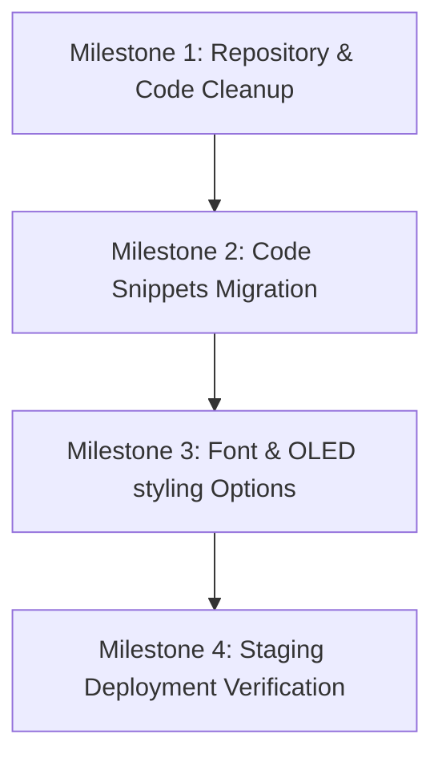

# First Implementation Recommendation & Roadmap (v2)

This document outlines the roadmap and technical choices to begin development on `junkfeathers.com` once the baseline audit is approved.

---

## 1. Milestone Path

The transition to active development is mapped into four distinct steps:



* **Milestone 1: Clean & Version Control**
  - Initialize the standalone Git repository (Option B).
  - Exclude must-use plugins, credentials, and `.disabled` recovery folders from Git tracking.
* **Milestone 2: Custom plugin migration**
  - Create the `junkfeathers-core` plugin directory.
  - Migrate "Junkfeathers Footer Text" (Snippet 5) to the plugin, and deactivate the database runner.
* **Milestone 3: Interface Styling Options**
  - Present font delivery, color palettes, and animation models to the founder for approval.
* **Milestone 4: Staging Setup & Search-Replace**
  - Deploy custom theme and plugin to a staging subdomain. Run database domain transformations.

---

## 2. Interface Styling & Font Loading Options

No design decision (such as fonts, colors, or animations) is made in this audit. The following options are presented with their technical tradeoffs for the founder's review:

### Option A: Typography Delivery Models

| Model | Implementation | Performance | Privacy | Accessibility | Maintenance |
| :--- | :--- | :--- | :--- | :--- | :--- |
| **System Fonts** | Use standard browser stacks (e.g. `system-ui, -apple-system, sans-serif`). | **Excellent**. Zero load time, zero requests. | **Excellent**. No external tracking. | **Good**. Highly readable. | **Excellent**. No files to manage. |
| **Self-Hosted Variable Fonts** | Download WOFF2 font files (e.g. *Outfit Variable*) and serve them directly from the child theme. | **Good**. Requires a single file download, but optimizes weights into one file. | **Excellent**. No external API calls. | **Excellent**. Clean layout consistency. | **Medium**. Requires storing files in the theme folder. |
| **External Google Fonts API** | Fetch fonts dynamically via Google's font CDN inside CSS. | **Medium**. Adds DNS lookup, preconnect delays, and external requests. | **Poor**. Triggers visitor IP queries to Google servers. | **Excellent**. Wide variety of choices. | **Low**. Google handles CDN hosting. |

---

### Option B: Visual Palette and Animation Style Options

The styling of the OLED interface can leverage different levels of visual effects, with distinct tradeoffs:

1. **Static Flat OLED (Highly Recommended)**:
   - *Description*: High contrast OLED blacks, crisp text, and solid green/amber glowing borders.
   - *Tradeoffs*: **Maximum performance and accessibility**. Lightweight CSS. Works perfectly on all mobile devices.
2. **Glassmorphic Panel Depth**:
   - *Description*: Adds backing blurs (`backdrop-filter`) and semi-transparent layers.
   - *Tradeoffs*: Medium performance. Can cause lag on older mobile devices or low-end Android phones.
3. **Mechanical Scanning & Scanline Textures**:
   - *Description*: Overlay CSS grid patterns or CRT flicker animations.
   - *Tradeoffs*: Heavy CSS rendering. Can trigger migraine/visual discomfort for users with vestibular sensitivities if animations flicker continuously. Requires clear toggle switches to turn off effects.

---

## 3. Staging Deployment & Search-Replace Procedures

To deploy changes to the live site securely and replace local domains:

### Step 1: File Copy (Local to Staging/Production)
Upload only the custom code directories to `/wp-content/themes/junkfeathers-machine/` and `/wp-content/plugins/junkfeathers-core/` on the server using SFTP.

### Step 2: Database Domain Search-and-Replace
To replace the local URL variables (`https://junkfeatherscom.local`) in serialized page data safely without breaking layouts, run the following WP-CLI command on the staging server:

```bash
wp search-replace 'https://junkfeatherscom.local' 'https://staging.junkfeathers.com' --precise --recurse-collate
```

### Verification & Rollback Procedure
* **Verification**: Immediately after deployment, check the browser console for any 404 errors or failed network requests to verify no local URLs remain.
* **Rollback**: If a database error occurs:
  1. Restore the staging database from the backup dump file immediately.
  2. If the custom child theme breaks the visual layout, reactivate the parent GeneratePress theme via WP-CLI:
     ```bash
     wp theme activate generatepress
     ```
